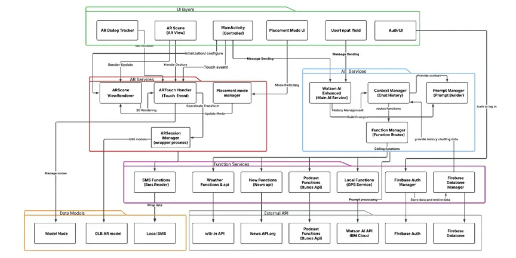

# AR AI Assistant with Watson Integration

An innovative Android AR application that combines Augmented Reality, AI-powered conversations, and intelligent function calling to create an interactive 3D cat assistant for elderly users.

The real function can be viewed in video by the link:  https://drive.google.com/file/d/15YkcbYLKabj9ReEJdZ6UtxJAz2emcyin/view?usp=sharing
## 📸 Live Demo & Screenshots

### AR Cat Interaction in Action
<p align="center">
  
  
  
</p>

## 🌟 Key Features

### Advanced AR Cat Interaction

#### 🎯 Intelligent Collision Detection System
- **Distance-Based Safety Zones**: Implements a 0.3-meter minimum distance between models to prevent overlap
- **Real-time Collision Checking**: Before placing a new cat, the system calculates distances to all existing models
- **Visual Feedback**: Users receive immediate feedback if placement would cause overlap
- **Touch Detection Radius**: 0.3-meter radius for accurate model selection without accidental touches

```kotlin
// Collision detection implementation
private fun checkPlacementOverlap(newWorldPosition: Position): Boolean {
    return placedModelNodes.any { existingModel ->
        val distance = calculateDistance(newWorldPosition, existingModel.worldPosition)
        distance < SAFE_PLACEMENT_DISTANCE // 0.3m safety zone
    }
}
```

#### 🔄 360° Smooth Rotation System
- **Velocity-Based Rotation**: Implements physics-based rotation with velocity damping (0.85 factor)
- **Smooth Interpolation**: Uses SMOOTH_FACTOR of 0.15 for buttery-smooth transitions
- **Gesture Recognition**: Distinguishes between tap (selection) and drag (rotation)
- **Adjustable Sensitivity**: X and Y axis sensitivity can be customized in settings
- **State Preservation**: Each model remembers its rotation state when deselected

```kotlin
// Rotation features
- Accumulated rotation values tracking
- Velocity damping for realistic physics
- Minimum rotation distance threshold (10px)
- Independent X/Y axis control
```

### AI-Powered Conversations with Fine-Tuned Watson

#### 🤖 Fine-Tuned Watson AI Model
- **Custom Training**: Fine-tuned specifically for elderly care conversations
- **Contextual Understanding**: Enhanced with conversation history management
- **Caring Personality**: Trained to respond with warmth and patience
- **Function Recognition**: Optimized to detect user intents and trigger appropriate functions

#### 💬 Intelligent Context Management
- **Query-Aware Context**: Extracts only relevant conversation history
- **Pollution Detection**: Filters out error messages and incomplete responses
- **Smart Summarization**: Limits context to 100 characters for efficiency
- **Relevance Scoring**: Prioritizes high-quality messages for context

### Intelligent Function Calling
- **Weather Services**: Real-time weather data with GPS/IP-based location detection
- **SMS Management**: Read unread messages, get summaries (with permissions)
- **News Integration**: Latest news across multiple categories (The News API)
- **Podcast Discovery**: Curated podcast recommendations (iTunes API)
- **Location Services**: Current location information with Open-Meteo geocoding

## 📁 Project Structure

```
app/
├── src/
│   ├── main/
│   │   ├── java/com/example/ibm_project/
│   │   │   ├── MainActivity.kt                 # Main entry point with AR scene
│   │   │   ├── auth/
│   │   │   │   ├── AuthRepository.kt          # Firebase authentication logic
│   │   │   │   ├── ChatRepository.kt          # Chat storage with context management
│   │   │   │   └── LoginScreen.kt             # Google Sign-In UI
│   │   │   ├── ui/
│   │   │   │   ├── theme/                     # Material3 theme configuration
│   │   │   │   ├── ARControlButtons.kt        # AR control panel UI
│   │   │   │   ├── ARDialogs.kt               # Settings and logout dialogs
│   │   │   │   └── SpeechToTextHandler.kt     # Voice input handling
│   │   │   └── chat/
│   │   │       └── ChatRepository.kt          # Enhanced context management
│   │   │
│   │   ├── ar/                                # AR Core Components
│   │   │   ├── ARSceneViewRenderer.kt         # AR session & state management
│   │   │   ├── ARTouchHandler.kt              # Touch interaction & collision
│   │   │   ├── ARDialogTracker.kt             # Dialog positioning system
│   │   │   ├── PlacementModeManager.kt        # Placement mode strategies
│   │   │   ├── PlacementModeUI.kt             # Mode switching UI
│   │   │   ├── FilamentViewer.kt              # Native Filament integration
│   │   │   └── wrapper/
│   │   │       ├── ARContracts.kt             # AR interfaces for testing
│   │   │       ├── ProductionImplementations.kt
│   │   │       └── TestImplementations.kt
│   │   │
│   │   ├── watsonx/                           # AI Integration
│   │   │   ├── WatsonAIEnhanced.kt           # Main AI service with functions
│   │   │   ├── ContextManager.kt             # Conversation context tracking
│   │   │   ├── FunctionCallManager.kt        # Function detection & routing
│   │   │   ├── PromptManager.kt              # Prompt template management
│   │   │   └── WatsonAIService.kt            # Base Watson API client
│   │   │
│   │   ├── functions/                         # Function Calling Services
│   │   │   ├── WeatherFunctions.kt           # Open-Meteo weather API
│   │   │   ├── SMSFunctions.kt               # Android SMS reader
│   │   │   ├── NewsFunctions.kt              # The News API integration
│   │   │   ├── PodcastFunctions.kt           # iTunes podcast search
│   │   │   └── LocationFunctions.kt          # GPS/IP geolocation
│   │   │
│   │   ├── ui/components/                     # Reusable UI Components
│   │   │   ├── UserInputField.kt             # Chat input with voice
│   │   │   ├── ChatBubble.kt                 # AR dialog bubbles
│   │   │   └── TypewriterEffect.kt           # Text animation
│   │   │
│   │   ├── models/
│   │   │   └── WeatherData.kt                # Data models
│   │   │
│   │   └── utils/
│   │       ├── SharedPrefsHelper.kt          # Local storage utilities
│   │       └── TypewriterEffect.kt           # Animation utilities
│   │
│   ├── androidTest/java/                      # Integration Tests
│   │   ├── flows/
│   │   │   └── ARInteractionFlowTest.kt      # Complete AR flow testing
│   │   └── integration/
│   │       ├── ARStateUIIntegrationTest.kt   # AR-UI integration
│   │       ├── ContextAIIntegrationTest.kt   # AI context testing
│   │       ├── FunctionServiceIntegrationTest.kt
│   │       ├── InputAIIntegrationTest.kt
│   │       └── ModelDialogIntegrationTest.kt
│   │
│   └── test/java/                             # Unit Tests
│       └── com/example/ibm_project/
│           └── ExampleUnitTest.kt
│
├── build.gradle.kts                           # App-level build config
├── google-services.json                       # Firebase configuration
└── proguard-rules.pro                        # ProGuard rules
```

## 🏗️ Technical Architecture

The system follows a layered architecture with clear separation of concerns, integrating AR capabilities, AI processing, and multiple external services. The architecture ensures smooth real-time interaction between AR models and AI responses.
<p align="center">
  
</p>
### Key Architecture Components
- **UI Layer**: Jetpack Compose with AR dialog tracking
- **AR Services**: ARCore + SceneView for 3D model management  
- **AI Processing**: Fine-tuned Watson AI with function calling
- **Data Layer**: Firebase for authenticated users, local storage for anonymous sessions

## 🔥 Core Components Details

### AR Components (`/ar`)

#### ARSceneViewRenderer.kt
- **Purpose**: Manages AR session lifecycle and state
- **Key Methods**:
  ```kotlin
  configureSession(arSession: Session, config: Config)
  onSessionUpdated(arSession: Session, updatedFrame: Frame)
  getUserFriendlyStatus(): String
  ```

#### ARTouchHandler.kt
- **Purpose**: Handles all touch interactions and model management
- **Key Features**:
  - Distance-based collision detection
  - Safe placement zones (0.3m minimum)
  - 360° rotation with velocity damping
  - Multi-model selection

#### PlacementModeManager.kt
- **Purpose**: Manages different AR placement strategies
- **Modes**:
  ```kotlin
  enum class PlacementMode {
      PLANE_ONLY,    // Traditional plane detection
      INSTANT_ONLY,  // Instant placement
      AUTO_MIXED     // Smart switching
  }
  ```

### AI Integration (`/watsonx`)

#### WatsonAIEnhanced.kt with Fine-Tuned Model
- **Purpose**: Main AI service orchestrator with fine-tuned Watson model
- **Fine-Tuning Details**:
  - Custom trained for elderly care conversations
  - Enhanced empathy and patience in responses
  - Optimized function detection accuracy
  - Specialized vocabulary for senior users
- **Flow**:
  ```
  User Input 
    → Context Extraction (ChatRepository)
    → Fine-Tuned Model Processing
    → Keyword Detection (PromptManager)
    → Function Recognition (FunctionCallManager)
    → Service Execution
    → Natural Language Response Generation
  ```

#### ContextManager.kt
- **Purpose**: Intelligent conversation history management
- **Features**:
  - Query-aware context extraction
  - Pollution detection
  - Smart summarization (100 char limit)
  - Relevance scoring

### Function Services (`/functions`)

#### Service Architecture
```kotlin
// Common interface pattern
suspend fun execute(functionName: String, arguments: String): String
fun getServiceStatus(): String
suspend fun testService(): String
```

#### Available Functions
| Service | Functions | API |
|---------|-----------|-----|
| Weather | `get_current_weather`, `get_weather_by_city` | Open-Meteo |
| SMS | `read_unread_messages`, `get_message_summary` | Android SMS |
| News | `get_latest_news`, `get_news_by_category` | The News API |
| Podcasts | `get_recommended_podcasts`, `search_podcasts` | iTunes |
| Location | `get_current_location`, `get_location_info` | GPS/IP |

## 🧪 Testing Architecture

### Integration Test Flows (`/androidTest`)

#### ARInteractionFlowTest.kt
Complete end-to-end AR interaction testing:
```kotlin
@Test
fun testCompleteModelPlacementFlow() {
    // Phase 1: AR environment initialization
    // Phase 2: Environment scanning
    // Phase 3: Touch detection
    // Phase 4: Placement verification
    // Phase 5: UI state update
}
```

#### Test Coverage Areas
- **AR State Management**: Session lifecycle, tracking status
- **Model Interactions**: Placement, selection, rotation
- **Collision Detection**: Distance checks, overlap prevention
- **UI Synchronization**: Dialog positioning, state updates
- **Error Recovery**: Session failure, tracking loss

### Testing Patterns

#### Wrapper Pattern for Testability
```kotlin
interface ARSessionManager {
    val detectedPlanesCount: State<Int>
    fun configureSession(arSession: Session?, config: Config?)
}

// Production implementation
class ProductionARSessionManager : ARSessionManager
// Test implementation  
class FakeARSessionManager : ARSessionManager
```

## 🔐 Firebase Integration

### Firestore Data Structure
```
users/
  └── {userId}/
      ├── name: String
      ├── email: String
      ├── avatar: String
      └── lastLogin: Timestamp

chat_history/
  └── {messageId}/
      ├── userId: String
      ├── userMessage: String
      ├── aiResponse: String
      └── timestamp: Timestamp
```

### Authentication Flow
```kotlin
// Google Sign-In
AuthRepository.getGoogleSignInIntent()
  → Google OAuth
  → Firebase Auth
  → Firestore Profile
  → MainActivity

// Anonymous Mode
AuthRepository.signInAnonymously()
  → Firebase Anonymous Auth
  → Local Storage Only
```

## 📊 Performance Metrics

### Optimization Strategies
- **Context Caching**: 10-minute API response cache
- **Token Management**: IAM token with 55-minute validity
- **Lazy Model Loading**: On-demand 3D asset loading
- **Coroutine Scopes**: Lifecycle-aware async operations
- **State Hoisting**: Compose state optimization

### Memory Management
```kotlin
// Automatic cache cleanup
fun clearExpiredCache() {
    val expiredKeys = weatherCache.entries
        .filter { currentTime - it.value.timestamp >= CACHE_EXPIRY_MS }
    expiredKeys.forEach { weatherCache.remove(it.key) }
}
```

## 🚀 Getting Started

### Prerequisites
- Android Studio Arctic Fox or later
- Minimum SDK: 24 (ARCore requirement)
- Target SDK: 35
- ARCore compatible device

### Installation

1. **Clone Repository**
```bash
git clone https://github.com/yourusername/ar-ai-assistant.git
cd ar-ai-assistant
```

2. **Firebase Setup**
```bash
# Add google-services.json to app/ directory
# Enable Authentication and Firestore in Firebase Console
```

3. **Configure API Keys**
```kotlin
// WatsonAIEnhanced.kt
private val config = WatsonAIConfig(
    baseUrl = "YOUR_WATSON_URL",
    apiKey = "YOUR_API_KEY",
    deploymentId = "YOUR_DEPLOYMENT_ID"
)

// NewsFunctions.kt
private const val API_TOKEN = "YOUR_NEWS_API_TOKEN"
```

4. **Build & Run**
```bash
./gradlew build
./gradlew installDebug
```

## 🎮 Usage Guide

### Basic AR Interaction
1. **Setup**: Grant camera and location permissions
2. **Scan**: Move device to detect planes
3. **Place**: Tap to place AR cats
4. **Interact**: Tap cat to select, drag to rotate

### AI Conversations
```
User: "What's the weather?"
AI: [Detects weather keyword]
    → Calls get_current_weather()
    → Returns: "It's 25°C and sunny in Taipei!"

User: "Do I have any messages?"
AI: [Detects SMS keyword]
    → Calls read_unread_messages()
    → Returns: "You have 3 unread messages..."

User: "Where am I?"
AI: [Detects location keyword]
    → Calls get_current_location()
    → Returns: "You're in Westminster, London"
```

## 🛠️ Development

### Build Configuration
```kotlin
// app/build.gradle.kts
dependencies {
    // AR
    implementation("io.github.sceneview:arsceneview:2.3.0")
    implementation("com.google.ar:core:1.41.0")
    
    // Firebase
    implementation(platform("com.google.firebase:firebase-bom:33.5.1"))
    implementation("com.google.firebase:firebase-auth")
    implementation("com.google.firebase:firebase-firestore")
    
    // Compose
    implementation(platform("androidx.compose:compose-bom:2024.02.00"))
    
    // Testing
    testImplementation("junit:junit:4.13.2")
    androidTestImplementation("androidx.compose.ui:ui-test-junit4")
}
```

### Environment Variables
Create `local.properties`:
```properties
sdk.dir=/path/to/android/sdk
watson.api.key=your_key_here
news.api.token=your_token_here
```

## 📈 Roadmap

- [ ] Multi-language support (Chinese, Japanese, Spanish)
- [ ] Voice interaction with wake word
- [ ] Cloud Anchors for shared AR
- [ ] Advanced gestures (pinch, swipe)
- [ ] Health monitoring integration
- [ ] Family sharing dashboard
- [ ] Offline mode support
- [ ] Custom 3D model upload

## 🤝 Contributing

1. Fork the repository
2. Create feature branch (`git checkout -b feature/AmazingFeature`)
3. Commit changes (`git commit -m 'Add AmazingFeature'`)
4. Push to branch (`git push origin feature/AmazingFeature`)
5. Open Pull Request

### Coding Standards
- Kotlin style guide compliance
- Comprehensive unit tests for new features
- Integration tests for user flows
- Documentation for public APIs

## 📄 License

This project is licensed under the MIT License - see [LICENSE](LICENSE) file.

## 👨‍💻 Author

**York Yi**
- GitHub: [@yourusername](https://github.com/yourusername)
- Email: yyisyork@gmail.com

## 🙏 Acknowledgments

- IBM Watson team for AI services
- Google ARCore team for AR framework
- SceneView contributors for AR simplification
- Open-Meteo for free weather API
- The News API team
- Firebase team for backend services

## 📸 Screenshots & Demo

### Real-time Features Demonstration
The screenshots showcase the complete AR-AI integration:

#### 1. AR Cat Placement & Controls
- Clean interface with intuitive control panel
- Real-time plane detection visualization
- Multiple placement modes (Plane/Instant/Auto)

#### 2. Collision Detection in Action
- Multiple cats placed with automatic spacing
- Visual feedback for safe placement zones
- Prevents model overlap with 0.3m safety radius

#### 3. AI Weather Function Response
- Natural language query: "What's the weather?"
- Automatic location detection: Taipei, Taiwan
- Real-time data: 26°C with overcast conditions
- Response displayed as floating dialog above AR cat

### UI Components
- **Voice Input**: Green microphone button for speech-to-text
- **Send Button**: Blue arrow for sending messages
- **Input Field**: "Start your chat!" prompt for elderly-friendly interaction
- **Mode Toggle**: Switch between AR placement strategies
- **Settings**: Adjust rotation sensitivity and preferences

---

**Built with ❤️ for elderly users, emphasizing accessibility and intuitive AR interactions**